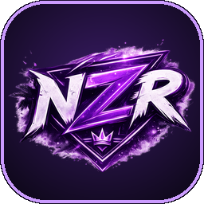

# NZR Meterion

**Le meter Aion 2 de la team NZR** · DPS en jeu · suivi des familiers · horaires EU

### [⬇️ Télécharger NZR-Meterion.exe](https://github.com/Nawax/NZR-Meterion-Releases/releases/latest/download/NZR-Meterion.exe)

*Un seul fichier, pas d'installation. Il se met à jour tout seul.*

---

## ✨ Ce que fait NZR Meterion

| | |
|---|---|
| ⚔️ **Overlay DPS en jeu** | Fenêtre indépendante posée sur le jeu : DPS, dégâts, part, soins, dégâts reçus — tu choisis les colonnes. Icônes de classe, ta ligne mise en avant. |
| 🐾 **Overlay Familiers** | Le familier que tu farmes en gros : `14 / 25`, barre de progression, ce qu'il reste jusqu'au niveau max (x/100). Il s'affiche dès que tu tapes son mob. Noms en français. |
| 🕒 **Horaires EU** | Faille spatio-temporelle, Festival Shugo, Invasion dimensionnelle, Kaira, Siège des artefacts, Exécuteurs, Nahma, arènes, resets — tu coches ce que tu veux voir. |
| 📊 **Fenêtre de combat** | Détail par joueur et par compétence, filtres par cible / classe / groupe, historique des combats. |
| 🎨 **Thème NZR** | Interface violette aux couleurs de la team, en français. |
| 🔄 **Mises à jour auto** | Au démarrage, NZR Meterion télécharge la nouvelle version et redémarre tout seul. |

## 🚀 Installation

1. **Installe [Npcap](https://npcap.com/#download)** (options par défaut) — c'est lui qui permet de lire le trafic du jeu.
2. **Télécharge [`NZR-Meterion.exe`](https://github.com/Nawax/NZR-Meterion-Releases/releases/latest/download/NZR-Meterion.exe)** et range-le dans un dossier à toi (ex. `D:\Jeux\NZR Meterion\`).
   > Évite `Program Files` : NZR Meterion n'y aurait pas le droit de se mettre à jour.
3. **Lance-le** (accepte la demande administrateur), puis **connecte-toi à ton perso** dans Aion 2.

## ⌨️ Raccourcis

| Raccourci | Action |
|---|---|
| `Ctrl` + `Alt` + `O` | Afficher / masquer l'overlay DPS |
| `Ctrl` + `Alt` + `F` | Afficher / masquer l'overlay Familiers |
| `Ctrl` + `Alt` + `T` | Afficher / masquer les Horaires |
| `Ctrl` + `Alt` + `H` | Fenêtre principale ⇄ mode overlay |
| `Ctrl` + `Alt` + `P` | Pause / reprise |

Tout se règle dans **Paramètres** (overlay DPS, familiers, horaires, raccourcis). Les overlays se déplacent en glissant leur en-tête et s'agrandissent par le coin en bas à droite. Tes réglages sont gardés dans `%APPDATA%\NZR Meterion`.

## ❓ Questions fréquentes

<b>Est-ce que je risque un ban ?</b>

NZR Meterion **ne touche pas au jeu** : pas d'injection, pas de lecture mémoire, il n'envoie aucun paquet. Il écoute seulement, en passif, le trafic réseau qui arrive sur ton PC (comme tous les meters Aion 2). Ce n'est pas un outil officiel : comme pour tout logiciel tiers, c'est sous ta responsabilité.

<b>Les familiers affichent « Niv. ? » ou un compteur faux</b>

La liste des familiers est envoyée par le jeu **à la connexion du personnage**. Lance NZR Meterion, puis déconnecte / reconnecte ton perso une fois : tout se recale.

<b>Je ne vois rien en jeu</b>

Vérifie que Npcap est installé, que tu as accepté la demande administrateur, puis active les overlays dans **Paramètres** (ou avec les raccourcis ci-dessus).

<b>Windows SmartScreen bloque l'exe</b>

L'exe n'est pas signé : clique sur **Informations complémentaires → Exécuter quand même**.

## 🙏 Crédits

- Basé sur [Aion DPS Meter](https://github.com/SkeeveAN/Aion-DPS-Meter) de SkeeveAN (licence MIT).
- Noms des mobs et familiers : données publiques de [NotMeter](https://notmeter.com).
- AION 2 est une marque de NCSOFT. Projet non officiel, sans lien avec NCSOFT.

**NZR** 👑

